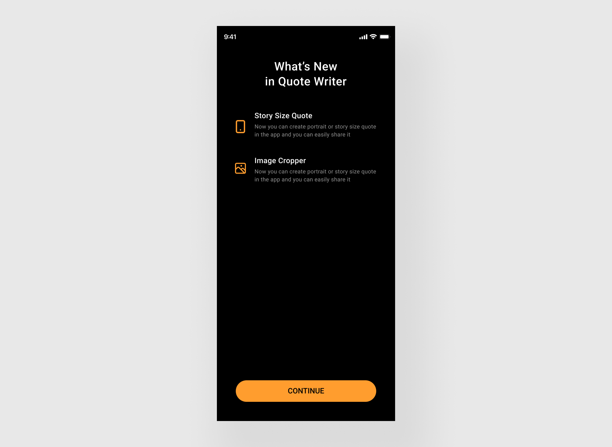

# whats_new_feature
Show apple like whats new feature on new update of your app

[![style: very good analysis][very_good_analysis_badge]][very_good_analysis_link]
[![License: MIT][license_badge]][license_link]

## Screenshot



## Installation

Add `whats_new_feature: ^0.0.1-dev.2` to your `pubspec.yaml` dependencies. And import it:

```dart
import 'package:whats_new_feature/whats_new_feature.dart';
```

## How to use

Simply call `showWhatsNew()` method from `WhatsNewFeature()`, and pass the required params:

```dart
@override
void initState() {
  super.initState();
  _showWhatsNew();
}

Future<void> _showWhatsNew() async {
  await const WhatsNewFeature().showWhatsNew(
    context,
    showWhatsNew: true,
    showWhatsNewOnFirstInstall: true,
    features: [
      WhatsNewFeatureTile(
        icon: Icons.browse_gallery_rounded,
        titleText: 'Story Size Quote',
        subtitleText:
        'Now you can create portrait or story size quote in the app and you can easily share it',
      ),
      WhatsNewFeatureTile(
        icon: Icons.pages,
        titleText: 'Image Cropper',
        subtitleText:
        'Now you can create portrait or story size quote in the app and you can easily share it',
      ),
      WhatsNewFeatureTile(
        icon: Icons.image,
        titleText: 'Persist last style',
        subtitleText:
        'Now quote writer app will persist the last edited style with image',
      ),
    ],
  );
}
```

[license_badge]: https://img.shields.io/badge/license-MIT-blue.svg
[license_link]: https://opensource.org/licenses/MIT
[very_good_analysis_badge]: https://img.shields.io/badge/style-very_good_analysis-B22C89.svg
[very_good_analysis_link]: https://pub.dev/packages/very_good_analysis